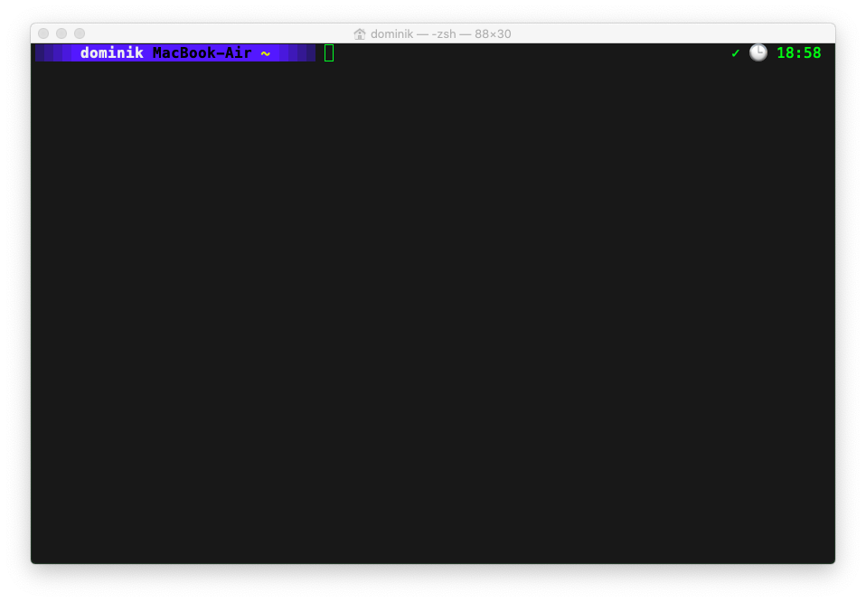

# ZSH Customization

## About

I absolutely love Oh-My-ZSH, but on systems that should stay rather pristine I dislike installing it.
This is what I made this ´.zshrc´ for.

## Install

Just install or append this file to your current ´.zshrc´ and adapt it to your needs. It is heavyly documented so that shouldn't be a problem.

## Customization

The script hooks some notifications up to advice you when a long running process finishes.

What means "long running"? you may ask... Well that's something that you can define.

Apart from that, you can define your own aliases.

You can define the colors of your ls command in the appropriate variable.

And of course, you can personalize your command prompt.

All references to the appropriate documentation is in place, so whatever documentation you may need, it's just there!
